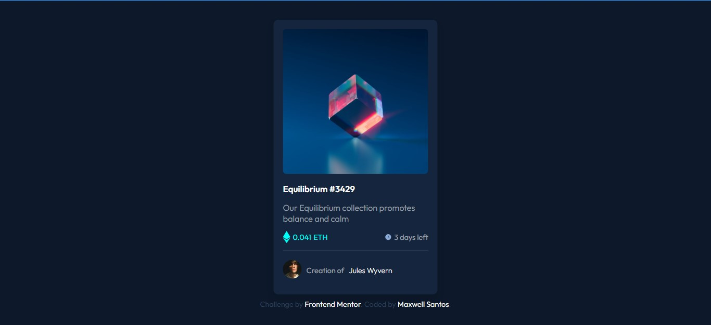

## Overview
### Screenshot


### Links

- Live Site URL: [Card NFT](https://nft-seven-nu.vercel.app/)
- Solution URL: [solution](https://www.frontendmentor.io/solutions/responsive-card-nft-S1Cs_UOE5)

## Meu processo

### Construido com

- Semantic HTML5 markup
- CSS custom properties
- Flexbox
- CSS Grid
- Mobile-first workflow
- Gsap lib to the window on load animation

### O que eu aprendi
- CSS
```css
.buy-post .buy img{ /*Animation for the Ethereum icon*/

  animation: bownce 1s infinite alternate ease-in-out ;

}

  @keyframes bownce{
    
    from{
    transform: translateY(-2px);
  }
  to{
    transform: translateY(2px);
  } 
}

```
- JS
```js
//LIB Gspa
    TweenMax.staggerFrom('.card', 2,{ //animation to the card
      delay: 0.2, 
      opacity: 0,
      y: 50,
      ease: Expo.easeInOut

    });
    TweenMax.staggerFrom('.attribution', 1.6,{ //animation to the footer
      delay: 1,
      opacity: 0,
      x: 50,
      ease: Expo.easeInOut

    });
```

## Light mode
```js
const icon = document.querySelector("#icon")
const body = document.querySelector("body") //select tag body

function add(){
  body.classList.toggle("lightmode") //add class to body

  //this help to toggle the img recognizing the current mode
  //isso ajuda a trocar a img reconhecendo o modo atual
  if(body.className == "lightmode"){ //if that class alredy exist, toggle the img (se a classe já existir, trocar img)
    icon.src ='images/moon-outline.svg'

  } else {
    icon.src ='images/sunny-outline.svg' //else, toggle de img (se não existir, trocar a img também)
  }
}
```
- Toggle colors CSS
<p>Todas as cores estão num escopo :root no css, daí basta acrescentar a classe "lightmode" dentro do body, com as cores reorganiadas para o modo claro, ja que por padrâo o site é escuro</p>

```css
:root{

  --bg-color: hsl(217, 54%, 11%);
  --bg-card-color: hsl(216, 50%, 16%);
  --fildset:hsl(215, 32%, 27%);

  --white: hsl(0, 0%, 100%);

  --cyan: hsl(178, 100%, 50%);

  --icon-color: hsl(0, 0%, 100%);

  --font-color: hsla(0, 0%, 100%, 0.575);
  
}
```

```css

.lightmode{
  
  transition: background .3s ease, color .3s ease;

  --bg-color: hsl(210, 40%, 92%);
  --bg-card-color: hsl(0, 0%, 93%);
  --fildset:hsl(218, 6%, 63%);

  --white: hsl(0, 0%, 24%);

  --cyan: hsl(178, 100%, 36%);

  --icon-color: hsl(0, 0%, 38%);

  --font-color: rgba(20, 20, 20, 0.719);

}
```
## Autor

- Frontend Mentor - [@Maxwell-Santos](https://www.frontendmentor.io/profile/Maxwell-Santos)
